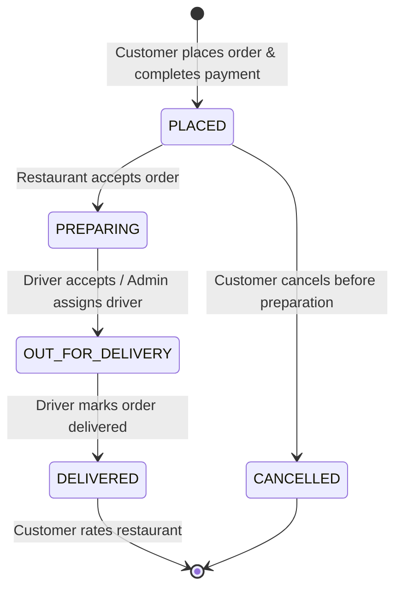
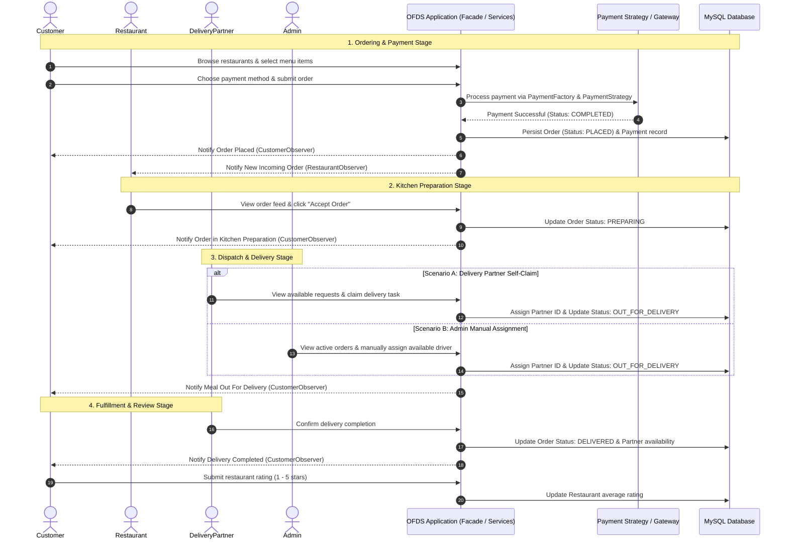
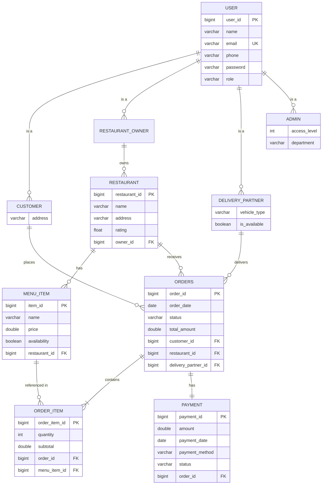

# 🍔 Online Food Delivery System (OFDS)

> A full-featured, multi-role web application simulating a complete food ordering, restaurant management, delivery logistics, and payment processing ecosystem built with **Java 17**, **Spring Boot 3**, **Spring Security**, **JPA / Hibernate**, **MySQL**, and **Thymeleaf**.

---

## 📑 Table of Contents
1. [About the System & How It Works](#-about-the-system--how-it-works)
2. [End-to-End System Workflow](#-end-to-end-system-workflow)
3. [User Roles & Key Features](#-user-roles--key-features)
4. [Object-Oriented Design Patterns (GoF)](#-object-oriented-design-patterns-gof)
5. [Database Schema & ER Diagram](#-database-schema--er-diagram)
6. [Technology Stack](#-technology-stack)
7. [Project Directory Structure](#-project-directory-structure)
8. [Setup & Installation Guide](#-setup--installation-guide)
9. [Demo Accounts & Pre-Seeded Credentials](#-demo-accounts--pre-seeded-credentials)
10. [Endpoint & Route Reference](#-endpoint--route-reference)

---

## 🌟 About the System & How It Works

The **Online Food Delivery System (OFDS)** is an interactive food delivery platform connecting four core actors:
- **Customers**: Browse dining spots, explore live menus, customize orders, simulate digital payments, and track meal delivery status.
- **Restaurant Owners**: Register restaurants, manage menus (pricing, availability, descriptions), and process incoming kitchen orders.
- **Delivery Partners**: Accept open delivery dispatches, manage active orders, and fulfill deliveries.
- **Administrators**: Monitor system-wide operations, audit user accounts and restaurants, manage delivery driver assignments, and generate financial reports.

### ⚙️ Core Working Principles
1. **Separation of Concerns**: Controllers handle web requests, service layers manage business logic, repositories handle persistence, and custom design patterns encapsulate complex workflows.
2. **Event-Driven Status Updates**: Order lifecycle state transitions trigger real-time observer notifications to all interested parties (Customer, Restaurant, Delivery Partner).
3. **Flexible Payment Processing**: Modular strategy pattern structure allows plug-and-play payment methods (UPI, Credit Card, Debit Card, Wallet) with realistic mock processing delays and validation.
4. **Role-Based Security**: Spring Security enforces strict role boundaries (`ROLE_CUSTOMER`, `ROLE_RESTAURANT_OWNER`, `ROLE_DELIVERY_PARTNER`, `ROLE_ADMIN`) with automatic post-login routing to role-specific dashboards.

---

## 🔄 End-to-End System Workflow

### 1. Order Lifecycle State Diagram


---

### 2. Comprehensive Multi-Actor Workflow


---

## 👥 User Roles & Key Features

### 1. 👤 Customer (`ROLE_CUSTOMER`)
- **Restaurant Discovery**: Search restaurants by name, address, or cuisine; filter and view live customer ratings.
- **Interactive Cart & Menu**: Browse dynamic menus, customize item quantities, and review calculated subtotals.
- **Multi-Method Checkout**: Pay via UPI, Credit Card, Debit Card, or In-App Wallet with validation checks.
- **Live Order Tracking**: Track real-time progress (`PLACED` ➔ `PREPARING` ➔ `OUT_FOR_DELIVERY` ➔ `DELIVERED`).
- **Order History & Cancellation**: View complete past order log; cancel orders before kitchen preparation begins.
- **Ratings & Reviews**: Rate restaurants after delivery to update platform averages.
- **Profile Management**: Update delivery address, phone number, and account details.

### 2. 🏪 Restaurant Owner (`ROLE_RESTAURANT_OWNER`)
- **Branch Management**: Register and configure restaurant profiles and locations.
- **Menu Management**: Add new menu items, update prices, modify item names, and toggle item availability (in-stock / out-of-stock).
- **Live Kitchen Feed**: View incoming pending orders for owned restaurant branches.
- **Order Handling**: Accept new orders and transition statuses from `PLACED` to `PREPARING`.

### 3. 🛵 Delivery Partner (`ROLE_DELIVERY_PARTNER`)
- **Delivery Request Pool**: View unassigned orders ready for dispatch.
- **Task Acceptance**: Accept delivery tasks directly from the driver dashboard.
- **Delivery Fulfillment**: Mark assigned orders as `OUT_FOR_DELIVERY` and `DELIVERED`.
- **Driver Profile**: Update contact information and vehicle type (`BIKE`, `SCOOTER`, `CAR`, `BICYCLE`).

### 4. 🛡️ System Administrator (`ROLE_ADMIN`)
- **Central Analytics Dashboard**: Real-time stats on total platform users, active restaurants, total orders placed, and gross platform revenue.
- **User Management**: View all registered users across all roles and remove accounts when necessary.
- **Restaurant Audit**: View and manage all platform restaurant listings.
- **Order Dispatch Management**: Monitor all live platform orders and manually reassign delivery partners to pending orders.
- **Financial & Operational Reports**: Breakdown of orders delivered vs. cancelled, along with individual transaction audit trails.

---

## 🎨 Object-Oriented Design Patterns (GoF)

The project implements 6 classical **Gang of Four (GoF)** design patterns to ensure clean, decoupled, and extensible architecture:

| Design Pattern | Category | Key Class(es) | Responsibility |
|---|---|---|---|
| **Builder Pattern** | Creational | `OrderBuilder` | Provides a fluent API to build complex `Order` objects and associate `OrderItem` instances step-by-step. |
| **Facade Pattern** | Structural | `OrderFacade` | Acts as a unified entry point that coordinates `OrderBuilder`, `PaymentFactory`, `OrderNotifier`, and persistence repositories. |
| **Factory Pattern** | Creational | `PaymentFactory` | Encapsulates the instantiation logic for creating concrete `PaymentStrategy` instances based on user selection. |
| **Strategy Pattern** | Behavioral | `PaymentStrategy`, `UPIPaymentStrategy`, `CreditCardPaymentStrategy`, `DebitCardPaymentStrategy`, `WalletPaymentStrategy` | Defines a family of interchangeable payment algorithms conforming to the Open/Closed Principle. |
| **Observer Pattern** | Behavioral | `OrderNotifier`, `OrderObserver`, `CustomerNotificationObserver`, `RestaurantNotificationObserver`, `DeliveryPartnerNotificationObserver` | Implements a publish-subscribe mechanism that alerts stakeholders automatically upon order status changes. |
| **Singleton Pattern** | Creational | `DatabaseManager` | Demonstrates thread-safe, double-checked locking Singleton implementation for centralized database state management. |

---

## 🗄️ Database Schema & ER Diagram



---

## 🛠️ Technology Stack

| Layer | Technology | Description |
|---|---|---|
| **Language** | Java 17 | Core programming language |
| **Framework** | Spring Boot 3.2.0 | Backend application framework |
| **Security** | Spring Security 6 | Role-based authorization & BCrypt password encryption |
| **ORM / Data Access** | Spring Data JPA / Hibernate 6 | Relational data persistence and mapping |
| **Database** | MySQL 8.0+ | Relational database management system |
| **Template Engine** | Thymeleaf 3 | Server-side HTML rendering |
| **Frontend UI** | HTML5, CSS3, JavaScript | Responsive UI with custom styling |
| **Build & Tooling** | Maven Wrapper (`mvnw`), Lombok | Build automation and boilerplate reduction |
| **Payment Simulation** | Custom Strategy Pattern + Razorpay SDK | Modular payment gateway integration |

---

## 📁 Project Directory Structure

```text
Online_food_delivery_ooad_team10-main/
├── pom.xml                               # Maven build configuration & dependencies
├── mvnw / mvnw.cmd                       # Maven wrapper executables
└── src/
    └── main/
        ├── java/com/ofds/
        │   ├── OfdsApplication.java      # Application main entry point
        │   ├── config/
        │   │   ├── DataSeeder.java       # Auto-seeds demo accounts & menus
        │   │   └── SecurityConfig.java   # Spring Security & role route mappings
        │   ├── controller/               # MVC Controllers
        │   │   ├── AdminController.java
        │   │   ├── AuthController.java
        │   │   ├── CustomerController.java
        │   │   ├── DeliveryPartnerController.java
        │   │   ├── MockPaymentController.java
        │   │   └── RestaurantOwnerController.java
        │   ├── model/                    # Domain Entities & Enums
        │   │   ├── User.java, Customer.java, RestaurantOwner.java, DeliveryPartner.java, Admin.java
        │   │   ├── Restaurant.java, MenuItem.java
        │   │   ├── Order.java, OrderItem.java, OrderStatus.java
        │   │   └── Payment.java, PaymentMethod.java, PaymentStatus.java, VehicleType.java
        │   ├── pattern/                  # GoF Design Patterns Implementation
        │   │   ├── builder/OrderBuilder.java
        │   │   ├── facade/OrderFacade.java
        │   │   ├── factory/PaymentFactory.java
        │   │   ├── observer/OrderNotifier.java, OrderObserver.java, etc.
        │   │   ├── singleton/DatabaseManager.java
        │   │   └── strategy/PaymentStrategy.java, UPIPaymentStrategy.java, etc.
        │   ├── repository/               # Spring Data JPA Repositories
        │   │   ├── UserRepository.java, CustomerRepository.java, AdminRepository.java, etc.
        │   │   ├── RestaurantRepository.java, MenuItemRepository.java
        │   │   └── OrderRepository.java, PaymentRepository.java
        │   └── service/                  # Business Services
        │       ├── UserService.java, RestaurantService.java
        │       ├── OrderService.java, PaymentService.java
        └── resources/
            ├── application.properties    # Server & MySQL connection configs
            ├── db/mysql-setup.sql        # Database initialization script
            ├── static/css/style.css      # UI styles
            └── templates/                # Thymeleaf views (auth, customer, owner, delivery, admin, payment)
```

---

## 🚀 Setup & Installation Guide

### Prerequisites
- **Java Development Kit (JDK)**: Version 17 or higher
- **MySQL Server**: Version 8.0 or higher
- **Maven**: Version 3.8+ (or use the included `./mvnw`)

---

### Step 1: Clone or Open Project
Open a terminal in the project directory:
```bash
cd Online_food_delivery_ooad_team10-main
```

---

### Step 2: Create the MySQL Database
Log into your MySQL console and create the database:
```sql
CREATE DATABASE ofds_db CHARACTER SET utf8mb4 COLLATE utf8mb4_unicode_ci;
```

---

### Step 3: Configure Database Credentials
Open `src/main/resources/application.properties` and verify your MySQL connection details:
```properties
spring.datasource.url=jdbc:mysql://localhost:3306/ofds_db?useSSL=false&serverTimezone=UTC&allowPublicKeyRetrieval=true
spring.datasource.username=root
spring.datasource.password=YOUR_MYSQL_PASSWORD
```

> **Note**: Hibernate (`ddl-auto=update`) creates all necessary tables and foreign keys automatically on startup.

---

### Step 4: Run the Application
Execute using the Maven Wrapper:

* **Windows (Command Prompt or PowerShell)**:
  ```powershell
  .\mvnw.cmd spring-boot:run
  ```
* **Linux / macOS**:
  ```bash
  chmod +x mvnw
  ./mvnw spring-boot:run
  ```

---

### Step 5: Open in Browser
Visit the application in your browser at:
```
http://localhost:8080
```

---

## 🔑 Demo Accounts & Pre-Seeded Credentials

On the first application run, `DataSeeder.java` populates demo restaurants, menus, and users for all roles:

| Role | Email | Password | Pre-loaded Entities / Data |
|---|---|---|---|
| **Admin** | `admin@ofds.com` | `admin123` | Full access to platform metrics, users, restaurants, reports |
| **Customer** | `sarthak@ofds.com` | `pass123` | Pre-configured customer with address (Koramangala, Bengaluru) |
| **Customer** | `sneh@ofds.com` | `pass123` | Pre-configured customer with address (Indiranagar, Bengaluru) |
| **Restaurant Owner** | `shravan@ofds.com` | `pass123` | Owns *Spice Garden* & *Biryani Palace* with pre-loaded menus |
| **Restaurant Owner** | `wadhwa@ofds.com` | `pass123` | Owns *The Pizza House* with pre-loaded menu |
| **Delivery Partner** | `ravi@ofds.com` | `pass123` | Delivery partner (Vehicle: Bike) |
| **Delivery Partner** | `priya@ofds.com` | `pass123` | Delivery partner (Vehicle: Scooter) |

---

## 🌐 Endpoint & Route Reference

### 1. Authentication & Public
- `GET /login` — Login page
- `POST /login` — Spring Security authentication handler (redirects automatically based on role)
- `GET /register` — Registration page
- `POST /register` — Account registration endpoint
- `GET /logout` — Logout handler

### 2. Customer Routes (`/customer/**`)
- `GET /customer/dashboard` — Customer dashboard with quick links & stats
- `GET /customer/restaurants` — Restaurant search & discovery
- `GET /customer/restaurant/{id}/menu` — Restaurant menu & cart selector
- `POST /customer/order/place` — Submit and place order
- `GET /customer/order/{id}` — Order tracking & details
- `GET /customer/orders` — Customer past order history
- `POST /customer/order/{id}/cancel` — Cancel active order (if unfulfilled)
- `POST /customer/restaurant/{id}/rate` — Submit rating for a restaurant
- `GET /customer/profile` & `POST /customer/profile/update` — Profile management

### 3. Payment Routes (`/payment/**`)
- `POST /payment/checkout` — Checkout overview
- `POST /payment/process` — AJAX payment execution endpoint (UPI / Card / Wallet simulation)

### 4. Restaurant Owner Routes (`/owner/**`)
- `GET /owner/dashboard` — Owner metrics & live kitchen alert feed
- `GET /owner/restaurants` — View & manage owned restaurant profiles
- `POST /owner/restaurant/create` — Register new restaurant branch
- `GET /owner/restaurant/{id}/menu` — Restaurant menu manager
- `POST /owner/restaurant/{id}/menu/add` — Add new dish to menu
- `POST /owner/menu/{itemId}/update` — Update dish details, pricing & availability
- `POST /owner/menu/{itemId}/delete` — Delete dish from menu
- `GET /owner/restaurant/{id}/orders` — Incoming orders view
- `POST /owner/order/{id}/accept` — Accept incoming order
- `POST /owner/order/{id}/status` — Update order preparation status

### 5. Delivery Partner Routes (`/delivery/**`)
- `GET /delivery/dashboard` — Driver dashboard & active deliveries
- `GET /delivery/requests` — View open delivery requests pool
- `POST /delivery/order/{id}/accept` — Accept & claim delivery job
- `POST /delivery/order/{id}/deliver` — Confirm delivery completion
- `GET /delivery/orders` — Driver delivery history
- `GET /delivery/profile` & `POST /delivery/profile/update` — Driver profile & vehicle info

### 6. Admin Routes (`/admin/**`)
- `GET /admin/dashboard` — High-level platform analytics & stats
- `GET /admin/users` & `POST /admin/users/{id}/delete` — User account management
- `GET /admin/restaurants` & `POST /admin/restaurants/{id}/delete` — Restaurant auditing
- `GET /admin/orders` — Real-time order monitoring
- `POST /admin/orders/{orderId}/assign` — Manually assign delivery partner to order
- `GET /admin/reports` — Platform financial and delivery performance reports
