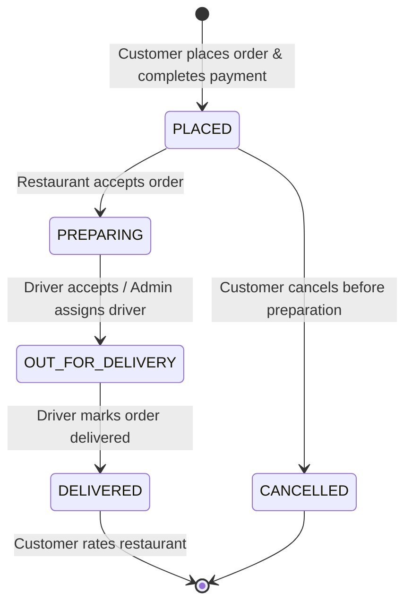
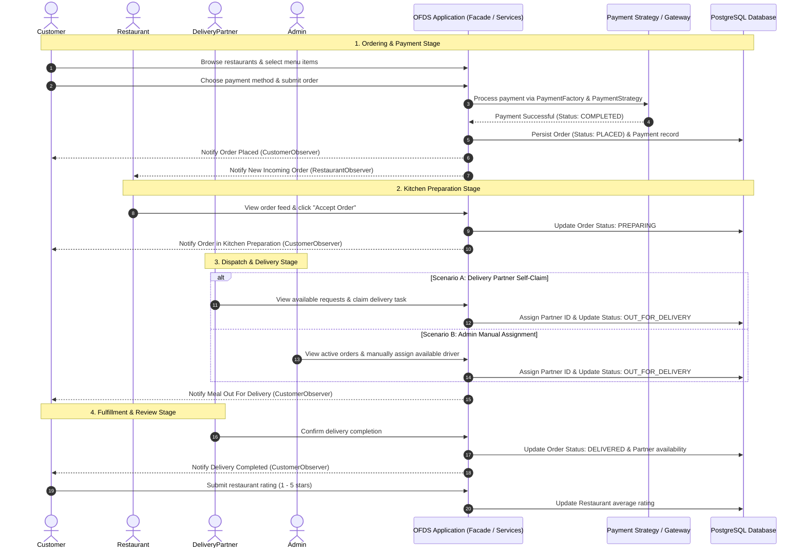
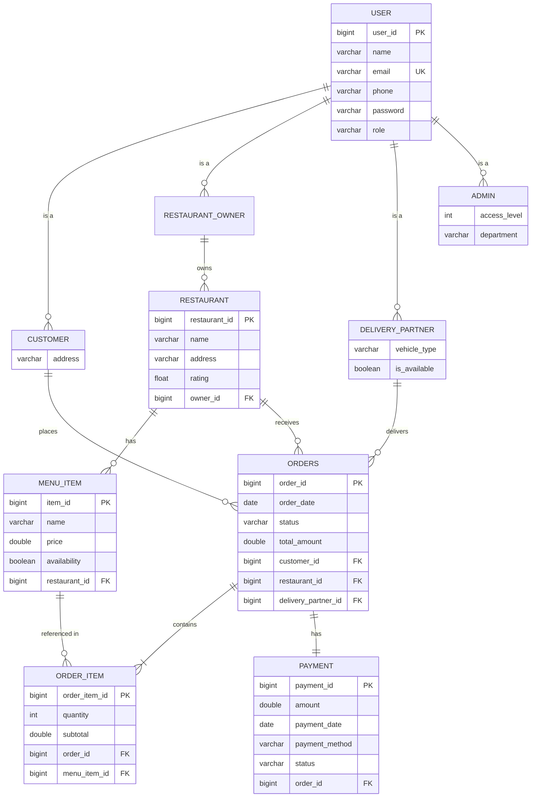

#  Online Food Delivery System (OFDS)

> A full-featured, multi-role web application simulating a complete food ordering, restaurant management, delivery logistics, and payment processing ecosystem built with **Java 17**, **Spring Boot 3**, **Spring Security**, **JPA / Hibernate**, **PostgreSQL**, and **Thymeleaf**.

---

##  Table of Contents
1. [About the System & How It Works](#-about-the-system--how-it-works)
2. [End-to-End System Workflow](#-end-to-end-system-workflow)
3. [User Roles & Key Features](#-user-roles--key-features)
4. [Object-Oriented Design Patterns (GoF)](#-object-oriented-design-patterns-gof)
5. [Database Schema & ER Diagram](#-database-schema--er-diagram)
6. [Technology Stack](#-technology-stack)
7. [Project Directory Structure](#-project-directory-structure)
8. [Setup & Installation Guide](#-setup--installation-guide)
9. [Demo Accounts & Pre-Seeded Credentials](#-demo-accounts--pre-seeded-credentials)
10. [Endpoint & Route Reference](#-endpoint--route-reference)

---

##  About the System & How It Works

The **Online Food Delivery System (OFDS)** is an interactive food delivery platform connecting four core actors:
- **Customers**: Browse dining spots, explore live menus, customize orders, simulate digital payments, and track meal delivery status.
- **Restaurant Owners**: Register restaurants, manage menus (pricing, availability, descriptions), and process incoming kitchen orders.
- **Delivery Partners**: Accept open delivery dispatches, manage active orders, and fulfill deliveries.
- **Administrators**: Monitor system-wide operations, audit user accounts and restaurants, manage delivery driver assignments, and generate financial reports.

###  Core Working Principles
1. **Separation of Concerns**: Controllers handle web requests, service layers manage business logic, repositories handle persistence, and custom design patterns encapsulate complex workflows.
2. **Event-Driven Status Updates**: Order lifecycle state transitions trigger real-time observer notifications to all interested parties (Customer, Restaurant, Delivery Partner).
3. **Flexible Payment Processing**: Modular strategy pattern structure allows plug-and-play payment methods (UPI, Credit Card, Debit Card, Wallet) with realistic mock processing delays and validation.
4. **Role-Based Security**: Spring Security enforces strict role boundaries (`ROLE_CUSTOMER`, `ROLE_RESTAURANT_OWNER`, `ROLE_DELIVERY_PARTNER`, `ROLE_ADMIN`) with automatic post-login routing to role-specific dashboards.

---

##  End-to-End System Workflow

### 1. Order Lifecycle State Diagram

```mermaid
stateDiagram-v2
    [*] --> PLACED : Customer places order & completes payment
    PLACED --> PREPARING : Restaurant accepts order
    PLACED --> CANCELLED : Customer cancels before preparation
    PREPARING --> OUT_FOR_DELIVERY : Driver accepts / Admin assigns driver
    OUT_FOR_DELIVERY --> DELIVERED : Driver marks order delivered
    DELIVERED --> [*] : Customer rates restaurant
    CANCELLED --> [*]
```

---

### 2. Comprehensive Multi-Actor Workflow

```mermaid
sequenceDiagram
    autonumber
    actor Customer
    actor Restaurant
    actor DeliveryPartner
    actor Admin
    participant OFDS as OFDS Application (Facade / Services)
    participant PaymentGW as Payment Strategy / Gateway
    participant DB as PostgreSQL Database

    %% Customer Stage
    Note over Customer,DB: 1. Ordering & Payment Stage
    Customer->>OFDS: Browse restaurants & select menu items
    Customer->>OFDS: Choose payment method & submit order
    OFDS->>PaymentGW: Process payment via PaymentFactory & PaymentStrategy
    PaymentGW-->>OFDS: Payment Successful (Status: COMPLETED)
    OFDS->>DB: Persist Order (Status: PLACED) & Payment record
    OFDS-->>Customer: Notify Order Placed (CustomerObserver)
    OFDS-->>Restaurant: Notify New Incoming Order (RestaurantObserver)

    %% Kitchen Stage
    Note over Restaurant,DB: 2. Kitchen Preparation Stage
    Restaurant->>OFDS: View order feed & click "Accept Order"
    OFDS->>DB: Update Order Status: PREPARING
    OFDS-->>Customer: Notify Order in Kitchen Preparation (CustomerObserver)

    %% Delivery Stage
    Note over DeliveryPartner,Admin: 3. Dispatch & Delivery Stage
    alt Scenario A: Delivery Partner Self-Claim
        DeliveryPartner->>OFDS: View available requests & claim delivery task
        OFDS->>DB: Assign Partner ID & Update Status: OUT_FOR_DELIVERY
    else Scenario B: Admin Manual Assignment
        Admin->>OFDS: View active orders & manually assign available driver
        OFDS->>DB: Assign Partner ID & Update Status: OUT_FOR_DELIVERY
    end
    OFDS-->>Customer: Notify Meal Out For Delivery (CustomerObserver)

    %% Completion Stage
    Note over Customer,DeliveryPartner: 4. Fulfillment & Review Stage
    DeliveryPartner->>OFDS: Confirm delivery completion
    OFDS->>DB: Update Order Status: DELIVERED & Partner availability
    OFDS-->>Customer: Notify Delivery Completed (CustomerObserver)
    Customer->>OFDS: Submit restaurant rating (1 - 5 stars)
    OFDS->>DB: Update Restaurant average rating
```

---

##  User Roles & Key Features

### 1.  Customer (`ROLE_CUSTOMER`)
- **Restaurant Discovery**: Search restaurants by name, address, or cuisine; filter and view live customer ratings.
- **Interactive Cart & Menu**: Browse dynamic menus, customize item quantities, and review calculated subtotals.
- **Multi-Method Checkout**: Pay via UPI, Credit Card, Debit Card, or In-App Wallet with validation checks.
- **Live Order Tracking**: Track real-time progress (`PLACED`  `PREPARING`  `OUT_FOR_DELIVERY`  `DELIVERED`).
- **Order History & Cancellation**: View complete past order log; cancel orders before kitchen preparation begins.
- **Ratings & Reviews**: Rate restaurants after delivery to update platform averages.
- **Profile Management**: Update delivery address, phone number, and account details.

### 2.  Restaurant Owner (`ROLE_RESTAURANT_OWNER`)
- **Branch Management**: Register and configure restaurant profiles and locations.
- **Menu Management**: Add new menu items, update prices, modify item names, and toggle item availability (in-stock / out-of-stock).
- **Live Kitchen Feed**: View incoming pending orders for owned restaurant branches.
- **Order Handling**: Accept new orders and transition statuses from `PLACED` to `PREPARING`.

### 3.  Delivery Partner (`ROLE_DELIVERY_PARTNER`)
- **Delivery Request Pool**: View unassigned orders ready for dispatch.
- **Task Acceptance**: Accept delivery tasks directly from the driver dashboard.
- **Delivery Fulfillment**: Mark assigned orders as `OUT_FOR_DELIVERY` and `DELIVERED`.
- **Driver Profile**: Update contact information and vehicle type (`BIKE`, `SCOOTER`, `CAR`, `BICYCLE`).

### 4.  System Administrator (`ROLE_ADMIN`)
- **Central Analytics Dashboard**: Real-time stats on total platform users, active restaurants, total orders placed, and gross platform revenue.
- **User Management**: View all registered users across all roles and remove accounts when necessary.
- **Restaurant Audit**: View and manage all platform restaurant listings.
- **Order Dispatch Management**: Monitor all live platform orders and manually reassign delivery partners to pending orders.
- **Financial & Operational Reports**: Breakdown of orders delivered vs. cancelled, along with individual transaction audit trails.

---

##  Object-Oriented Design Patterns (GoF)

The project implements 6 classical **Gang of Four (GoF)** design patterns to ensure clean, decoupled, and extensible architecture:

| Design Pattern | Category | Key Class(es) | Responsibility |
|---|---|---|---|
| **Builder Pattern** | Creational | `OrderBuilder` | Provides a fluent API to build complex `Order` objects and associate `OrderItem` instances step-by-step. |
| **Facade Pattern** | Structural | `OrderFacade` | Acts as a unified entry point that coordinates `OrderBuilder`, `PaymentFactory`, `OrderNotifier`, and persistence repositories. |
| **Factory Pattern** | Creational | `PaymentFactory` | Encapsulates the instantiation logic for creating concrete `PaymentStrategy` instances based on user selection. |
| **Strategy Pattern** | Behavioral | `PaymentStrategy`, `UPIPaymentStrategy`, `CreditCardPaymentStrategy`, `DebitCardPaymentStrategy`, `WalletPaymentStrategy` | Defines a family of interchangeable payment algorithms conforming to the Open/Closed Principle. |
| **Observer Pattern** | Behavioral | `OrderNotifier`, `OrderObserver`, `CustomerNotificationObserver`, `RestaurantNotificationObserver`, `DeliveryPartnerNotificationObserver` | Implements a publish-subscribe mechanism that alerts stakeholders automatically upon order status changes. |
| **Singleton Pattern** | Creational | `DatabaseManager` | Demonstrates thread-safe, double-checked locking Singleton implementation for centralized database state management. |

---

##  Database Schema & ER Diagram


```mermaid
erDiagram
    USER ||--o{ CUSTOMER : "is a"
    USER ||--o{ RESTAURANT_OWNER : "is a"
    USER ||--o{ DELIVERY_PARTNER : "is a"
    USER ||--o{ ADMIN : "is a"

    RESTAURANT_OWNER ||--o{ RESTAURANT : "owns"
    RESTAURANT ||--o{ MENU_ITEM : "has"
    
    CUSTOMER ||--o{ ORDERS : "places"
    RESTAURANT ||--o{ ORDERS : "receives"
    DELIVERY_PARTNER ||--o{ ORDERS : "delivers"
    
    ORDERS ||--|{ ORDER_ITEM : "contains"
    MENU_ITEM ||--o{ ORDER_ITEM : "referenced in"
    ORDERS ||--|| PAYMENT : "has"

    USER {
        bigint user_id PK
        varchar name
        varchar email UK
        varchar phone
        varchar password
        varchar role
    }

    CUSTOMER {
        varchar address
    }

    DELIVERY_PARTNER {
        varchar vehicle_type
        boolean is_available
    }

    ADMIN {
        int access_level
        varchar department
    }

    RESTAURANT {
        bigint restaurant_id PK
        varchar name
        varchar address
        float rating
        bigint owner_id FK
    }

    MENU_ITEM {
        bigint item_id PK
        varchar name
        double price
        boolean availability
        bigint restaurant_id FK
    }

    ORDERS {
        bigint order_id PK
        date order_date
        varchar status
        double total_amount
        bigint customer_id FK
        bigint restaurant_id FK
        bigint delivery_partner_id FK
    }

    ORDER_ITEM {
        bigint order_item_id PK
        int quantity
        double subtotal
        bigint order_id FK
        bigint menu_item_id FK
    }

    PAYMENT {
        bigint payment_id PK
        double amount
        date payment_date
        varchar payment_method
        varchar status
        bigint order_id FK
    }
```

---

##  Technology Stack

| Layer | Technology | Description |
|---|---|---|
| **Language** | Java 17 | Core programming language |
| **Framework** | Spring Boot 3.2.0 | Backend application framework |
| **Security** | Spring Security 6 | Role-based authorization & BCrypt password encryption |
| **ORM / Data Access** | Spring Data JPA / Hibernate 6 | Relational data persistence and mapping |
| **Database** | PostgreSQL 13+ | Relational database management system |
| **Template Engine** | Thymeleaf 3 | Server-side HTML rendering |
| **Frontend UI** | HTML5, CSS3, JavaScript | Responsive UI with custom styling |
| **Build & Tooling** | Maven Wrapper (`mvnw`), Lombok | Build automation and boilerplate reduction |
| **Payment Simulation** | Custom Strategy Pattern + Razorpay SDK | Modular payment gateway integration |

---

##  Project Directory Structure

```text
Online_food_delivery_system-main/
 pom.xml                               # Maven build configuration & dependencies
 mvnw / mvnw.cmd                       # Maven wrapper executables
 src/
     main/
         java/com/ofds/
            OfdsApplication.java      # Application main entry point
            config/
               DataSeeder.java       # Auto-seeds demo accounts & menus
               SecurityConfig.java   # Spring Security & role route mappings
            controller/               # MVC Controllers
               AdminController.java
               AuthController.java
               CustomerController.java
               DeliveryPartnerController.java
               MockPaymentController.java
               RestaurantOwnerController.java
            model/                    # Domain Entities & Enums
               User.java, Customer.java, RestaurantOwner.java, DeliveryPartner.java, Admin.java
               Restaurant.java, MenuItem.java
               Order.java, OrderItem.java, OrderStatus.java
               Payment.java, PaymentMethod.java, PaymentStatus.java, VehicleType.java
            pattern/                  # GoF Design Patterns Implementation
               builder/OrderBuilder.java
               facade/OrderFacade.java
               factory/PaymentFactory.java
               observer/OrderNotifier.java, OrderObserver.java, etc.
               singleton/DatabaseManager.java
               strategy/PaymentStrategy.java, UPIPaymentStrategy.java, etc.
            repository/               # Spring Data JPA Repositories
               UserRepository.java, CustomerRepository.java, AdminRepository.java, etc.
               RestaurantRepository.java, MenuItemRepository.java
               OrderRepository.java, PaymentRepository.java
            service/                  # Business Services
                UserService.java, RestaurantService.java
                OrderService.java, PaymentService.java
         resources/
             application.properties    # Server & PostgreSQL connection configs
             db/postgresql-setup.sql   # PostgreSQL database initialization script
             static/css/style.css      # UI styles
             templates/                # Thymeleaf views (auth, customer, owner, delivery, admin, payment)
```

---

##  Setup & Installation Guide

### Prerequisites
- **Java Development Kit (JDK)**: Version 17 or higher
- **PostgreSQL Server**: Version 13 or higher
- **Maven**: Version 3.8+ (or use the included `./mvnw`)

---

### Step 1: Clone or Open Project
Open a terminal in the project directory:
```bash
cd Online_food_delivery_system-main
```

---

### Step 2: Create the PostgreSQL Database
Log into PostgreSQL and create the database:
```sql
CREATE DATABASE ofds_db;
```

---

### Step 3: Configure Database Credentials
Open `src/main/resources/application.properties` and verify your PostgreSQL connection details:
```properties
spring.datasource.url=jdbc:postgresql://localhost:5432/ofds_db
spring.datasource.username=postgres
spring.datasource.password=YOUR_POSTGRES_PASSWORD
```

Or configure the values in PowerShell for the current terminal:
```powershell
$env:DB_URL = "jdbc:postgresql://localhost:5432/ofds_db"
$env:DB_USERNAME = "postgres"
$env:DB_PASSWORD = "YOUR_POSTGRES_PASSWORD"
```

> **Note**: Hibernate (`ddl-auto=update`) creates all necessary tables and foreign keys automatically on startup.

---

### Step 4: Run the Application
Execute using the Maven Wrapper:

* **Windows (Command Prompt or PowerShell)**:
  ```powershell
  .\mvnw.cmd spring-boot:run
  ```
* **Linux / macOS**:
  ```bash
  chmod +x mvnw
  ./mvnw spring-boot:run
  ```

---

### Step 5: Open in Browser
Visit the application in your browser at:
```
http://localhost:8080
```

### Build and test commands

Windows PowerShell:
```powershell
.\mvnw.cmd clean test
.\mvnw.cmd spring-boot:run
```

Linux/macOS:
```bash
./mvnw clean test
./mvnw spring-boot:run
```

The application uses PostgreSQL and Hibernate creates the local development schema
when `spring.jpa.hibernate.ddl-auto=update` is enabled. Payment processing is a
local simulation; no real card, UPI, wallet, or banking transaction is performed
and payment credentials are not persisted.


## License

MIT, see [LICENSE](LICENSE).

